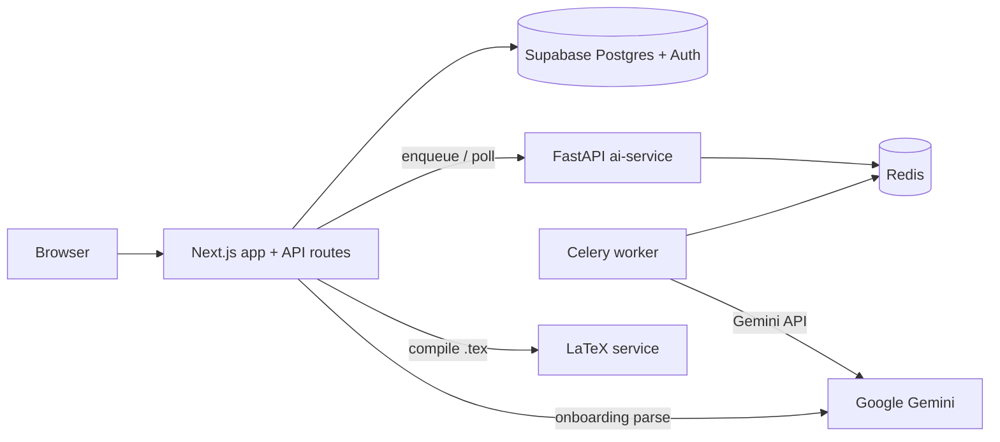

# Arcuris

Arcuris helps new grad software engineers generate tailored, ATS-ready resumes for specific roles and track applications in one place. Users upload a baseline resume, complete a one-time AI interview to capture context their resume misses, then paste a job description to receive a refined resume in under two minutes. Every generation is saved as an application record automatically—no separate tracker to maintain.

## Features

- **AI-powered resume tailoring** — Rewrites experience bullets to match a pasted job description while staying truthful to the user's inventory.
- **Three-pass LLM pipeline** — Draft, evaluate, and refine passes (with draft/refined scores and bullet-level feedback).
- **Async job processing with Celery** — Long-running generation runs in a background worker; the Next.js app polls for completion.
- **Professional PDF generation with LaTeX** — Jake-style resume layout compiled via Tectonic in a dedicated service.
- **Microservices architecture** — Next.js app, FastAPI + Celery AI service, LaTeX compile service, Redis, and Supabase Postgres.
- **Onboarding flow** — Resume upload/PDF parse, structured extraction, and AI-generated interview questions.
- **Application dashboard** — View past generations, scores, status, and download PDFs.

## Tech stack

| Layer | Technologies |
| --- | --- |
| **Frontend** | Next.js 14 (App Router), React 18, TypeScript, Tailwind CSS |
| **Backend** | Next.js API routes, Supabase Auth + PostgreSQL |
| **AI service** | FastAPI, Celery, Redis, Google Gemini (`gemini-2.5-flash`) |
| **PDF generation** | LaTeX (Jake template), Tectonic, Express microservice, Docker |
| **Database** | Supabase (PostgreSQL, Row Level Security) |
| **Hosting (intended)** | Vercel (Next.js), AWS EC2 or similar (AI + LaTeX workers), Redis Cloud |

## Architecture overview

The app splits responsibilities across a Next.js monolith and two supporting services. Supabase handles authentication, persistence, and RLS-isolated data. Gemini is called from both Next.js (onboarding parse/interview) and the AI worker (resume generation pipeline).



**Resume generation flow**

1. User submits a job description on `/generate`.
2. `POST /api/generate` validates auth, loads `inventory` from Supabase, and enqueues a Celery task via `POST /jobs/generate` on the AI service.
3. A `generation_jobs` row stores the Celery `task_id` for polling.
4. The Celery worker runs **draft → evaluate → refine** (three Gemini calls) and stores the result in Redis.
5. The client polls `GET /api/generate?taskId=...`, which checks the AI service and, on success, inserts an `applications` row (idempotent via `source_task_id`).
6. `GET /api/applications/[id]/pdf` builds LaTeX from structured `resume_json`, calls the LaTeX service `/compile`, and returns a PDF download.

**PDF export flow**

1. Next.js builds Jake-style `.tex` from `resume_json`.
2. `LATEX_SERVICE_URL/compile` runs Tectonic in Docker and returns raw PDF bytes.

## Project structure

```
arcuris/
├── app/                    # Next.js App Router pages and API routes
├── components/             # React UI (auth, generate, resume, onboarding)
├── lib/                    # Shared logic (Supabase, Gemini, LaTeX, AI client, types)
├── ai-service/             # FastAPI + Celery resume generation worker
├── latex-service/          # Express + Tectonic PDF compile service
├── supabase/migrations/    # Postgres schema and RLS policies
├── docker-compose.yml      # LaTeX, AI service, Celery worker, Redis
└── Arcuris_PRD.md          # Product requirements
```

## Getting started

### Prerequisites

- **Node.js** 18+ and npm
- **Docker** and Docker Compose (for LaTeX, AI service, Celery, Redis)
- **Supabase project** — [supabase.com](https://supabase.com) hosted project, or [Supabase CLI](https://supabase.com/docs/guides/cli) for local Postgres (`supabase start`)
- **Google Gemini API key** — [Google AI Studio](https://aistudio.google.com/)

### 1. Clone and install

```bash
git clone <repository-url>
cd arcuris
npm install
```

### 2. Configure environment

Copy the example file and fill in values (see [Environment variables](#environment-variables)):

```bash
cp .env.example .env.local
```

For Docker Compose, ensure `GEMINI_API_KEY` is available to the compose process (e.g. in a root `.env` file or your shell environment).

### 3. Set up the database

Apply migrations to your Supabase project:

```bash
# Hosted: link project and push migrations
supabase link --project-ref <your-project-ref>
supabase db push

# Or local
supabase start
supabase db reset   # applies migrations under supabase/migrations/
```

Enable **Email** auth in the Supabase dashboard if using hosted Supabase.

### 4. Start backing services

```bash
docker compose up --build
```

This starts:

| Service | Host URL |
| --- | --- |
| LaTeX compile | `http://localhost:8000` |
| AI service (FastAPI) | `http://localhost:8001` |
| Redis | `localhost:6379` |

### 5. Run the Next.js app

```bash
npm run dev
```

Open [http://localhost:3000](http://localhost:3000). Sign up, complete onboarding (upload → interview), then generate a resume from `/generate`.

### Optional: LaTeX service without Docker

```bash
npm run latex:dev
```

Requires Tectonic installed locally and `LATEX_SERVICE_URL=http://localhost:8000`.

## Environment variables

Set these in `.env.local` for Next.js. Docker Compose reads `GEMINI_API_KEY` from the host environment for `ai-service` and `celery-worker`.

| Variable | Required by | Description |
| --- | --- | --- |
| `NEXT_PUBLIC_SUPABASE_URL` | Next.js | Supabase project API URL |
| `NEXT_PUBLIC_SUPABASE_ANON_KEY` | Next.js | Supabase anonymous (public) key for client auth |
| `SUPABASE_SERVICE_ROLE_KEY` | Next.js (server) | Service role key for admin operations (e.g. onboarding writes); never expose to the browser |
| `GEMINI_API_KEY` | Next.js, AI service | Google Gemini API key for parsing, interview, and generation |
| `AI_SERVICE_URL` | Next.js | Base URL of the FastAPI service (e.g. `http://127.0.0.1:8001` with default Docker port mapping) |
| `LATEX_SERVICE_URL` | Next.js | Base URL of the LaTeX compile service (default `http://localhost:8000`) |
| `CELERY_BROKER_URL` | AI service, Celery | Redis broker URL (set automatically in `docker-compose.yml`) |
| `CELERY_RESULT_BACKEND` | AI service, Celery | Redis result backend URL (set automatically in `docker-compose.yml`) |
| `PORT` | LaTeX service | HTTP port for the LaTeX container (default `8000`) |

## Main routes

| Route | Description |
| --- | --- |
| `/` | Marketing landing |
| `/login`, `/signup` | Supabase email/password auth |
| `/onboarding/upload` | Resume upload or paste |
| `/onboarding/interview` | AI interview questions |
| `/dashboard` | Application tracker |
| `/generate` | Job description input and generation |
| `/resume/[id]` | Resume preview, bullet feedback, PDF download |

## API routes (Next.js)

| Endpoint | Method | Purpose |
| --- | --- | --- |
| `/api/onboarding/parse` | POST | Parse resume PDF/text → structured inventory |
| `/api/onboarding/interview` | POST | Save interview answers |
| `/api/generate` | POST | Enqueue resume generation job |
| `/api/generate?taskId=` | GET | Poll job status; persist application on success |
| `/api/applications/[id]/pdf` | GET | Compile and download PDF |

## Database tables

- **`inventory`** — Parsed resume JSON and interview answers per user
- **`applications`** — Generated resumes, scores, JD, status, bullet feedback, `resume_json`
- **`generation_jobs`** — Maps Celery `task_id` to user and optional `application_id`

All tables use Row Level Security: users can only access their own rows (`auth.uid() = user_id`).

## Scripts

| Command | Description |
| --- | --- |
| `npm run dev` | Start Next.js development server |
| `npm run build` | Production build |
| `npm run start` | Run production server |
| `npm run lint` | ESLint |
| `npm run latex:dev` | Run LaTeX service locally (no Docker) |

## Deployment notes

- **Next.js** — Deploy to Vercel (or similar); set all Next.js env vars in the project settings.
- **AI service + Celery + Redis** — Run on a VM or container platform; point `AI_SERVICE_URL` from Vercel to the public FastAPI URL. Use Redis Cloud or managed Redis for broker/backend in production.
- **LaTeX service** — Deploy the `latex-service` image where Tectonic can run; set `LATEX_SERVICE_URL` on Vercel.
- **Supabase** — Use a hosted project; run migrations via `supabase db push` in CI or manually.

## Documentation

- Product requirements: [`Arcuris_PRD.md`](./Arcuris_PRD.md)

## License

Private project — all rights reserved unless otherwise specified by the repository owner.
